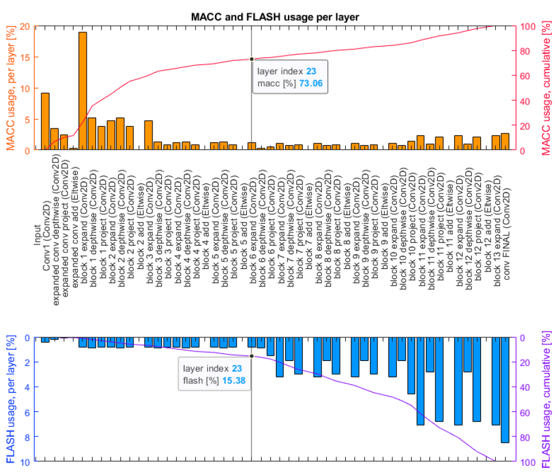
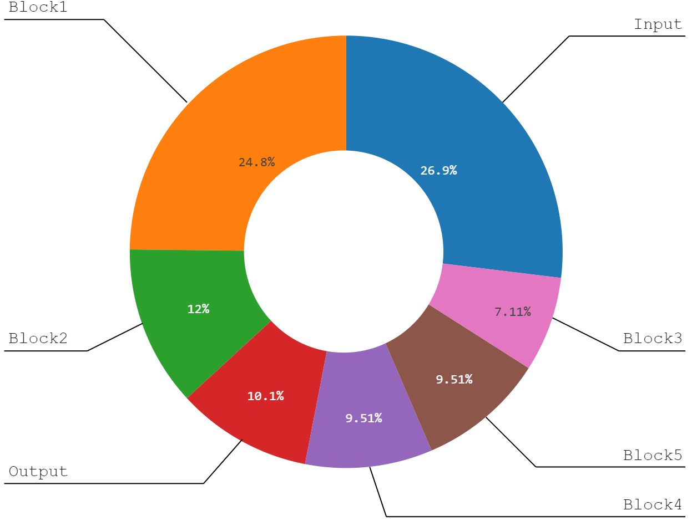
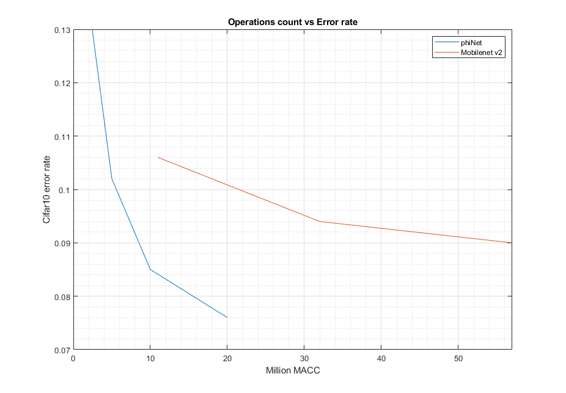
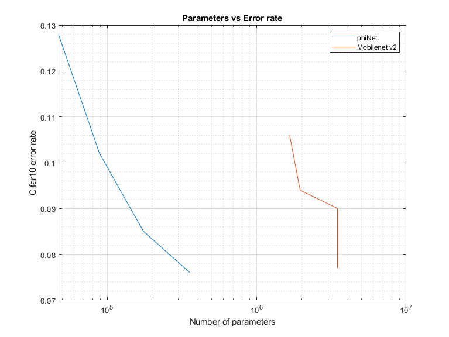
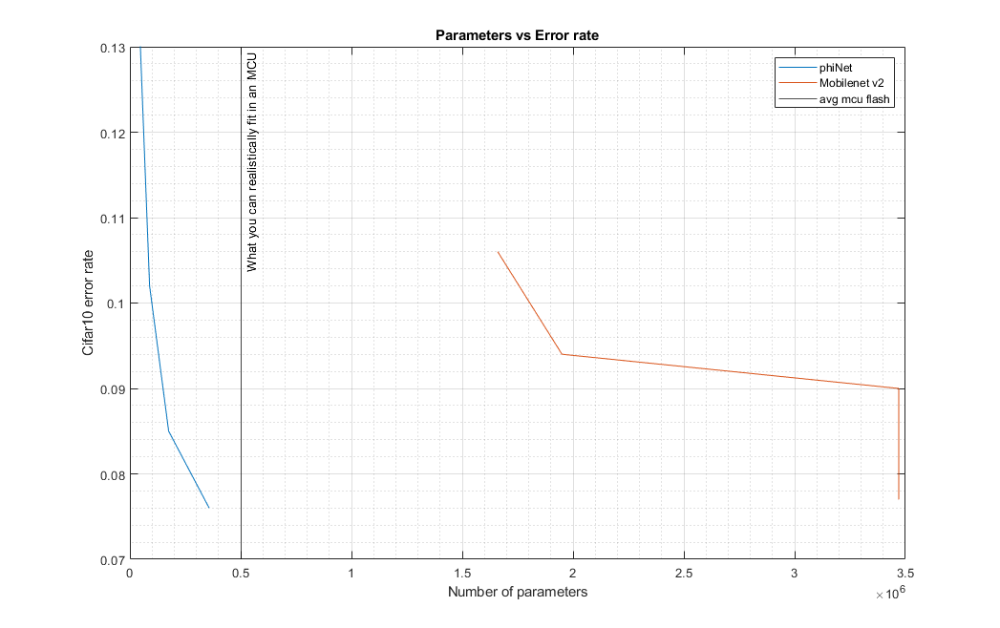

# phiNets - Neural networks for microcontrollers

So, a neural network in a microcontroller - why? Well, the idea is becoming more and more common, as there are three main factors that play a role:

- Deep learning is pushing more and more to more efficient models, requiring less and less memory and computation to achieve higher and higher accuracies - an example of this can be found in the Mobilenet architecture developed by Google [1], in order to allow for mobile devices to run CNN-based algorithms or the family of EfficientNet [2] networks

- Recent microcontrollers are getting closer and closer to application processors' levels of performance - the STM32H7 line of MCU is a great example of this, and these devices are already used for machine vision applications (just look at the OpenMV devices). Also, a plethora of frameworks are being developed to allow for more efficient implementation of CNNs into these devices, such as CMSIS-NN/ TF Lite for microcontrollers/ STs CUBE AI...

- Research in IoT is always looking for smaller, lower power, more efficient devices with higher and higher computational capabilities - if IoT was once just a "measure the temperature and send it via radio" job, today we are looking at systems that must be able to perform audio classification, detect and read license plates, detect and monitor wildlife... all while requiring very limited energy and ideally being supplied from small solar panels

The main reason for the popularity of this principle is that being able to process data on an MCU is orders of magnitudes more efficient than using, for example, a cloud-based approach where data is uploaded to big data centers for processing.

But, despite all this, there currently is no 'standard' state of the art network architecture that is developed targeting MCUs resources - usually, these tasks employ custom networks with relatively low efficiency when compared to more common nets developed for larger systems.

# Target

My objective here is developing a family of very small networks (ideally with 1 million to 10 million of multiply-accumulate operations - MACCs) that can offer comparable performances to current state of the art models but with requirements that can fit a modern microcontroller. The models will be developed for computer vision applications (so, they take an image as input) and will need to offer good performances in a standard dataset such as `CIFAR10`. I'm using CIFAR10 instead of the more common `ImageNet` benchmark as training will be much faster and this will allow me to test more iterations of networks, and because, given the large number of classes in ImageNet, the last, fully connected layer of networks would require the vast majority of parameters of the network when dealing with very small models.

So, as I said in the introduction, there are already some architectures targeting low resource usage, like the Mobilenet family, and this is where we will start. Mobilenets are based on the concept of replacing 2D convolutions with depthwise separable convolutions, a sequence of 2 operations - a depthwise convolution operating on each channel separately and a pointwise convolution operating along the channel axis only. This greatly reduces operation count and number of parameters, and allows for the creation of relatively small networks (the default Mobilenet v2 with a 216*216 input requires approximately 300 million MACCs).

There are mainly two ways of lowering the operation count of these architectures:

- Using a smaller input image - this way, each internal layer will have a lower dimensionality, so it will require fewer operations. Approximately, when reducing the input height and width of a factor `r`, the MACC count will be lowered by a factor `r^2` (so, using a 108*108 input we will only require 1/4 of the MACCs of the original network)

- Changing the number of filters used in each of the network layers - this is defined by the hyperparameter `alpha` in the network, which linearly scales the number of filters used. Again, MACC count depends on `alpha^2`, but also the memory footprint required by the network scales from this parameter in the same way

But, the performance of the model drops rapidly when lowering these factors. The smallest mobilenet v2 (96*96 input, alpha=0.35) requires 11 million MACCs, has 1.7 million parameters, and loses over 25% in top-1 accuracy and 20% in top-5 accuracy with respect to the full-sized model. Also, 1.7 million parameters are way too many parameters when we start dealing with MCUs - we usually only have some 100s of Kb of flash memory available, and, even when using a single byte to quantize each weight, this model would still require ~1.7MB for network weights only.

## Mobilenet v2 depth and parameter memory

So, in order to optimize the number of parameters used, we can start from a standard mobilenet v2 implementation and just remove the last N layers. In fact, given how CNNs work, usually deeper layers of the networks have spatially smaller feature maps, but with increased depth (number of channels). As the parameter count in a convolution depends quadratically on the number of channels, it is easy to see why these last layers require the majority of the parameters of the network. Moreover, as we are targeting easier applications than a 1000 classes classification task, the very high number of convolutional filters learned by these layers only does so much in improving accuracy.

The above image shows the cost, in terms of MACCs and memory, of the various layers of the network. We can see that ~85% of the memory and ~25% of all MACCs are required by the last half of the network. Using only the first 12 blocks instead of 14 and training the two networks on `Cifar10`, the shallower network requires only ~50% of the parameters of the full network, with under 0.01% loss in accuracy. Bringing this concept to the extreme and only using 5 blocks gives us a ~90% reduction in the number of parameters with a 0.5% loss in accuracy - a very good tradeoff in my opinion.

Given these results, let's say that a good starting point for our network will be a sequence of inverted residual blocks (like those used in the Mobilenet v2), with 5 to 12 blocks - the exact number will be identified later with a Network Architecture Search (NAS) algorithm.

## Strides and downsampling

The standard for Imagenet classification is using a network with 5 downsampling layers - in the Mobilenet case, this is obtained by using (2,2)-strided convolutions. But, with the small input resolution provided by the `Cifar10` images, this would mean that the final layers of the network must work on a 1x1 sized feature map. For this, our network will have a smaller downsampling ratio in order to be able to work with 32x32 images (the actual input size will be higher as explained later). Also, due to efficiency constraints, all downsampling operations will be performed as soon as possible in the first layers of the network. In particular, we'll use a (3,3)-strided input convolution and a (2,2)-strided convolution in the first layer, in order to drop the spatial resolution (which lowers the number of operations in the network by r^2). 

When training a standard Mobilenet v2 and our shallower version with tuned downsampling (adjusting the input resolution in order to obtain the same number of MACCs for both networks - in this case using `cv2.LINEAR` interpolation to increase the input resolution), we obtain a ~15% increase in accuracy.

## Depthwise separable input

The Mobilenet v2 architecture implements a standard 2D convolution in the input layer, which requires almost 25% of all network operations. I replaced it with a depthwise separable conv, dropping the operation count by ~13% with an accuracy loss of 0.28%.

## Additional enhancements

A squeeze-and-excite block is added before the projection convolution of each block, as done with the EfficientNet architecture. This increases accuracy by 64% with a negligible impact on operation count, and a 2% increase in parameter count.

The `ReLu` activation used in the original Mobilenet is replaced with an `H-swish` activation, a linearized swish found to be better performing than ReLu [3]. We use the linearized version instead of the original one as, given the application, the weights of the networks will, more often than not, need to be quantized, and the linearization was found to be much more resilient to this process (while the accuracy of a quantized network based on the original `swish` would drop a lot more).

## Depthwise separable convolution tuning

The original Mobilenet v2 used depthwise separable convolution with a fixed expansion factor of 6. In the paper, it is mentioned how a slightly lower one could be a better choice for smaller networks, but it is left at that. In the _Searching for MobileNetV3_ paper, Google researchers instead used a network search algorithm in order to tune the number of filters of each block, both in the low filter count projection layers, and in the high filter count expansion layers. Now, I don't have Google's servers at home to train a quintillion networks, so we'll approximate this task with:

- 2 'groups' of blocks - 'input' blocks with a certain number of filters `b1`, and 'mid-network' blocks with `b2` filters. If other downsampling layers are added, filter count is doubled from `b2` for the subsequent blocks
- A fixed _base expansion factor_ `t0`, which linearly scales all expansion factors of all blocks
- A _shape factor_ `beta`, which changes the expansion factor linearly from `t0` in the first block to `beta*t0` on the last one

This gives us a decent number of degrees of freedom to work with, that we can feed to a network search algorithm, without searching for 28 different parameters as done with Mobilenet v3.

## 5x5 convolutions

Mobilenet v2 only relied on 3x3 convolutions to lower parameter count and complexity, but Google decided that actually some 5x5 are useful and increase accuracy in [3]. So, our architecture will contain both 3x3 in the highest spatial resolution input layers and 5x5 in the later layers. We'll feed our network search algorithm an additional parameter that defines the percentage of blocks with 5x5 convolutions - 50% will mean that the last half of the blocks will have the larger convolutions and so on, instead of looking to optimize the behavior of every single block.

# Network architecture search

In order to optimize the performance per MACC of the architecture, a NAS algorithm is used, which randomly samples an architecture given a collection of hyperparameters, trains it for some epochs, and keeps the best models at a fixed MACC number.

In particular, in order to keep the search space small, the hyperparameters to be tuned are:
- Input resolution
- Number of blocks in the network
- Width multiplier `alpha`
- Shape factor `beta`
- Base expansion factor `t0`
- Input filters and number of filters of the 2 different groups of blocks `b1` and `b2`
- Percentage of blocks with 5x5 convolutions

In particular, the procedure works like this:
- Start from a default model architecture (the best performing until this step)
- Randomly change _some_ of these hyperparameters (2 by default) in some acceptable range
- Find the number of MACCs effectively required (`ME`) by using the `tf.profiler`
- Randomly adjust another hyperparameter by multiplying if by `(MT-ME)/MT` (with `MT` target MACC count)
- Keep repeating this last step until the effective MACCs are close enough to the target (with by default a 5% error)
- Train the architecture for a small number of epochs and check the accuracy

This approach is not the most efficient one as we are reaching our MACC target by subsequent (often incorrect) approximations, but it is very general (we could add any hyperparameter provided that increasing it would increase the effective MACC count). We could make the thing more mathematically correct by, for example, considering that scaling input size or width multiplier scales the number of operations quadratically, while the number of filters quadratically scales the operations of a single group of blocks... In practice, this doesn't make the approach that much faster as 99% of the time is spent training the network, and provides a bit more randomness to the search.

I'll look for three base networks, at MACC counts of 
- 20M MACC (large, high performing, for more complex workloads)
- 10M MACC (the smallest Mobilenet already reaches this target)
- 5M MACC (this should allow for around 20 inference passes per second on a recent, 400MHz, Cortex-M7)
- 2M MACC (for very constrained environments or very fast inference speed)

I'll check the `Cifar10` accuracy of these three networks against the Mobilenet v2 counterparts.
For training both types of networks, I'm using label smoothing, mixup, and a cosine learning rate. Input images are upscaled through linear interpolation. Mobilenet models are randomly initialized instead of using the pre-trained weights on ImageNet to keep the comparison fair.

# Results

I left the NAS algorithm run for 6 hours per architecture (around 5/6 min are needed to train and evaluate the architecture for 6 epochs), and trained the resulting network for 60 epochs - I'm sure better networks could be generated using a more refined search approach/ evaluating more architectures for more epochs. 
With this approach, for the 10M MACC target complexity, we obtain a 21% decrease in error rate for `Cifar10` classification. The 5M MACC network still outperforms the 11M MACC Mobilenet v2, offering a 2.9% decrease in error rate, while reducing operation count by 54%. The smallest network showed a classification accuracy of 86.8%, which was a bit lower than expected - probably more time to generate the architecture would increase this result.

Where this architecture really shines, and the reason why it is targeted at microcontrollers, is the memory footprint. In a modern MCU, we are lucky to have half a MB of storage available (flash memory is the most expensive part of the die) - so an architecture that can lower the flash usage is obviously a much better choice for ultra resource constrained applications.

The following plot shows (_in log scale!_) the error rate of the networks given their number of parameters (and memory footprint). We can see that, on average, networks with the same error rate show a **95% decrease in parameter count**. This means that, while even the smallest mobilenet is very difficult to run in even the most expensive MCUs without needing external memory, this architecture can be comfortably fit in even the lower-cost options. The smallest architecture requires less than 40K parameters, making it theoretically possible to **fit in the flash space of an Arduino**.

As a wise man once said,[ log scales are for quitters who can't find enough paper to make their point _properly_ ](https://xkcd.com/1162/) so here's the above plot in linear scale

The resulting architectures are so composed:

MACCs | Parameters | Accuracy (100 ep) | Resolution | blocks | `alpha` | `beta` | `t0` | input filters | b1 filters | b2 filters | c5%  
--- | --- | --- |  --- | --- | --- | --- | --- | --- | --- | --- | ---
**2M** | **39.9K** | **86.8%** | 68x68 |    8|  0.138|  0.4|    7|  96| 87| 129|    0.468
**5M** | **88.9K** | **90.2%**| 82x82 | 10| 0.138|  0.67|   6|  61| 107|    179|    0.468
**10M** |**175K** | **91.5%**| 96x96 |  10| 0.1973| 0.854|  6|  61| 60| 178|    0.468
**20M** |**358K** | **92.4%**| 89x89 |  15| 0.183|  1.656|  6|  99| 60| 173|    0.577

[1] [Mobilenet v2](https://arxiv.org/abs/1801.04381)
[2] [EfficientNet](https://arxiv.org/abs/1905.11946)
[3] [Mobilenet v3](https://arxiv.org/abs/1905.02244)